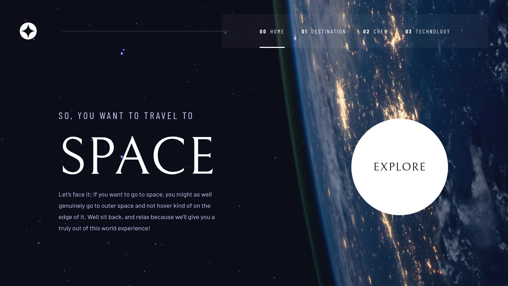

# 🌌 Space Tourism Website



## 📄 Descrição

Este projeto é a minha solução para o desafio Space Tourism Website do site Frontend Mentor.

## 🔗 Links

-   Solução: [aqui](https://www.frontendmentor.io/solutions/space-tourism-website-PxUSY3RJqN)
-   Link do projeto: [aqui](https://space-tourism-website-sigma-sooty.vercel.app/)

## 🛠 Tecnologias Utilizadas

-   [React](https://reactjs.org/)
-   [TypeScript](https://www.typescriptlang.org/)
-   [Styled Components](https://styled-components.com/)
-   [React Router](https://reactrouter.com/)
-   [React Query](https://github.com/TanStack/query)
-   [Eslint](https://eslint.org/)
-   [Prettier](https://prettier.io/)
-   [EditorConfig](https://editorconfig.org/)
-   [Vite](https://vitejs.dev/)

## 📋 Pré-requisitos

Antes de começar, você vai precisar ter instalado em sua máquina as seguintes ferramentas: [Git](https://git-scm.com/), [Node.js](https://nodejs.org/en).

Além disto é bom ter um editor para trabalhar com o código como [VSCode](https://code.visualstudio.com/).

## 🚀 Como Executar

```bash
# Clone este repositório
$ git clone https://github.com/grazziotti/space-tourism-website

# Acesse a pasta do projeto no terminal/cmd
$ cd space-tourism-website

# Instale as dependências
$ npm install

# Execute o projeto
$ npm run dev
```

## 👤 Autor


-   Github - [@grazziotti](https://github.com/grazziotti)
-   Frontend Mentor - [@grazziotti](https://www.frontendmentor.io/profile/grazziotti)
